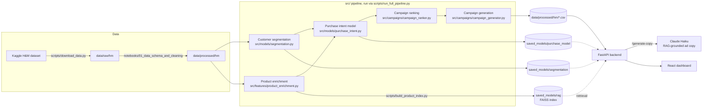
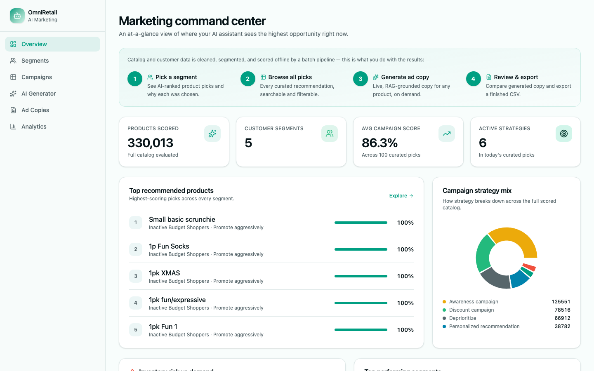
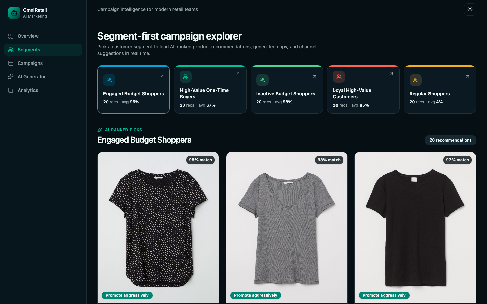
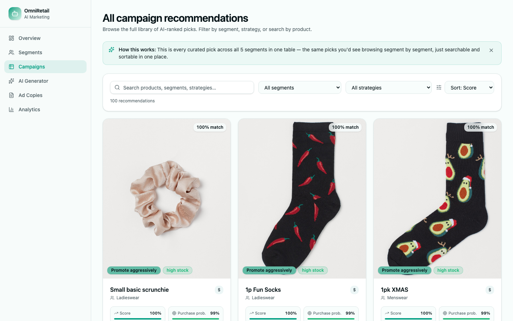
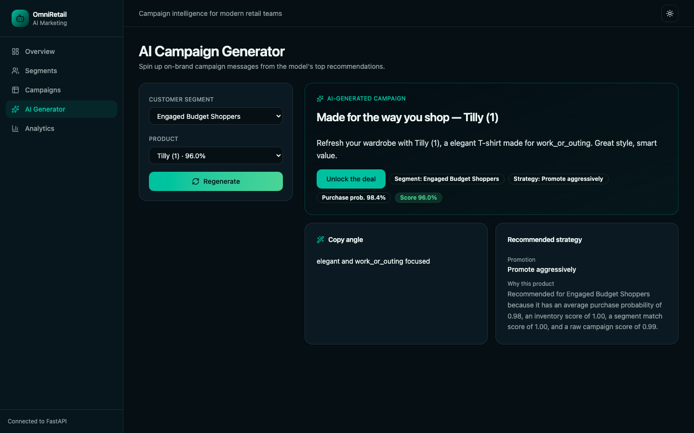
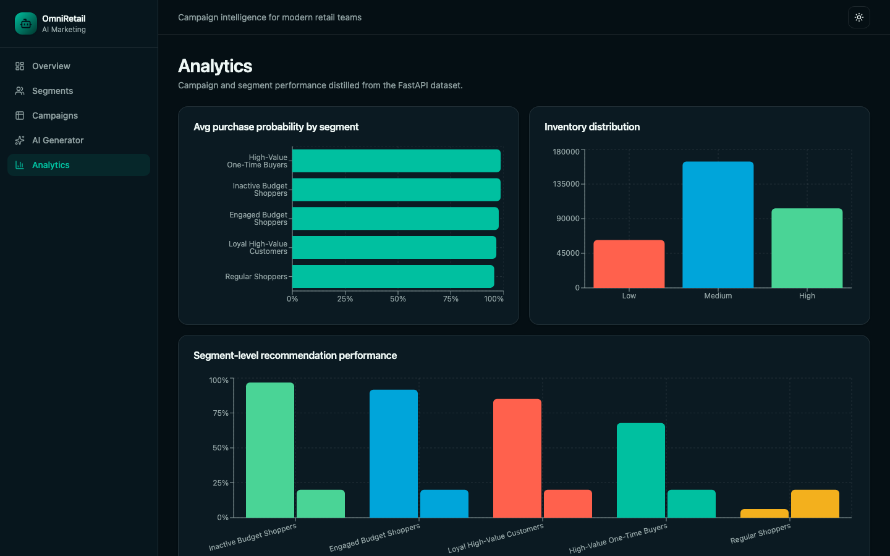
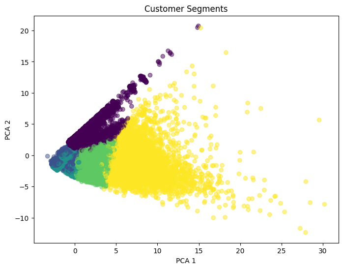
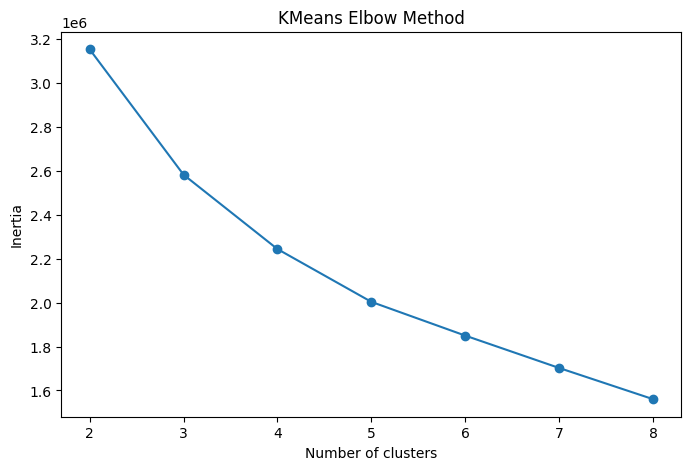

# OmniRetail AI

**An end-to-end retail marketing intelligence pipeline — from raw transaction data to a segmented, ranked, ready-to-ship campaign dashboard.**

Portfolio project built to demonstrate applied data science and ML engineering: customer segmentation, a supervised purchase-intent model, and an inventory-aware campaign ranking system, served through a FastAPI backend and a React dashboard.

> Built for **AI/ML Engineer**, **Data Scientist**, and **Data Analyst** roles.

---

## Problem Statement

Retail marketing teams manage thousands of products across multiple customer segments, but typically lack the tooling to plan campaigns at that scale:

- Campaign planning is manual and doesn't scale with catalog size or customer diversity.
- Promotions are rarely tied to actual purchase likelihood or current inventory, wasting spend on products customers won't buy or that are already out of stock.
- Customer segments exist as a concept ("loyal", "budget-conscious") but aren't operationalized into an actual targeting workflow.

**OmniRetail AI** turns raw customer/transaction/product data into a ranked list of "which product, to which segment, with what strategy" — the concrete output a marketing team would act on.

## Key Features

- **Customer segmentation** — KMeans clustering over RFM-style behavioral features, producing five named segments (e.g. *Loyal High-Value Customers*, *Inactive Budget Shoppers*) with a documented strategy per segment ([reports/segment_strategy.md](reports/segment_strategy.md))
- **Product enrichment** — derives style/occasion tags and marketing attributes per product from catalog metadata
- **Purchase-intent prediction** — an XGBoost classifier trained on simulated customer-product interactions, predicting purchase probability per customer-product pair
- **Inventory-aware campaign ranking** — combines purchase probability × inventory signal × segment-fit score into a single campaign score, with a human-readable ranking explanation per recommendation
- **RAG-grounded ad-copy generation** — a FAISS index over the ~105K-product catalog (TF-IDF + SVD embeddings) retrieves similar products at request time to ground a live Claude Haiku call, so generated copy is tied to real catalog context instead of a fixed template
- **FastAPI backend** — serves segments, ranked campaigns, summary stats, and live RAG-grounded copy generation as JSON
- **React dashboard** — a TanStack Start app with 5 views: overview, segment explorer, campaign list, analytics, and a campaign generator

## Tech Stack

| Layer | Tools |
|---|---|
| Data / ML | Python, pandas, NumPy, scikit-learn, XGBoost, joblib |
| RAG | FAISS, scikit-learn (TF-IDF + TruncatedSVD embeddings), Anthropic Claude (`claude-haiku-4-5`) |
| Data source | [Kaggle H&M Personalized Fashion Recommendations](https://www.kaggle.com/competitions/h-and-m-personalized-fashion-recommendations) dataset, via `kagglehub` |
| Backend | FastAPI, Uvicorn |
| Frontend | React 19, TanStack Start/Router/Query, Tailwind CSS, Radix UI |
| Deploy target | Cloudflare (Vite plugin + `wrangler` config included) |

## Architecture



## Setup

### 1. Clone and install Python dependencies

```bash
git clone git@github.com:Letitia-Chang/omni-retail-ai.git
cd omni-retail-ai
python -m venv venv && source venv/bin/activate
pip install -r requirements.txt
```

### 2. Get the data

Requires a [Kaggle](https://www.kaggle.com/) account with `kaggle.json` credentials in `~/.kaggle/` (and having accepted the competition rules).

```bash
python scripts/download_data.py
```

Then run [notebooks/01_data_schema_and_cleaning.ipynb](notebooks/01_data_schema_and_cleaning.ipynb) to produce the cleaned `data/processed/hm/` tables the pipeline expects (`customers.csv`, `articles.csv`, `transactions.csv`).

### 3. Run the ML pipeline

```bash
python scripts/run_full_pipeline.py
```

This runs segmentation → product enrichment → purchase-intent modeling → campaign ranking → campaign generation in sequence, writing outputs to `data/processed/hm/` and trained models to `saved_models/`.

### 4. Build the RAG product index

```bash
python scripts/build_product_index.py
```

Embeds the enriched product catalog (TF-IDF + SVD) and builds a FAISS index at `saved_models/rag/` — this grounds the live ad-copy generation endpoint. Takes well under a minute (no GPU or large model download required).

Then copy `.env.example` to `.env` and set `ANTHROPIC_API_KEY` (get one at [console.anthropic.com](https://console.anthropic.com/)) — required for `/generate-copy`. Without it, the dashboard still runs fine and falls back to the pre-computed ad-copy template.

### 5. Run the backend

```bash
uvicorn backend.main:app --reload
```

Serves at `http://127.0.0.1:8000` — see `/` for available endpoints.

### 6. Run the frontend

```bash
cd frontend
cp .env.example .env   # points the dashboard at the local API
npm install
npm run dev
```

Dashboard runs at `http://localhost:3000` (TanStack Start dev server).

## Demo

With the backend and frontend both running:

1. **Overview** (`/`) — total campaigns, segment count, average campaign score
2. **Segments** (`/segments`) — explore each customer segment and its top recommended products
3. **Campaigns** (`/campaigns`) — search/filter the full ranked campaign list
4. **Analytics** (`/analytics`) — score distributions and inventory-level breakdowns
5. **Generator** (`/generator`) — walks through a single campaign recommendation with its ranking explanation, and generates live RAG-grounded ad copy via Claude (falls back to a pre-computed template if `ANTHROPIC_API_KEY` isn't set)

## Screenshots

**Overview** — live campaign stats, top recommendations, and strategy mix



**Segments** — pick a segment, browse its AI-ranked product picks with images



**Campaigns** — full ranked list with search and filters



**AI Generator** — single-campaign recommendation with its ranking explanation



**Analytics** — score and inventory distributions across segments



**Modeling notebooks** — customer segmentation (PCA projection and elbow method)




## Limitations & Future Improvements

- **Bulk product enrichment (`product_enrichment.py`) is still rule-based** (keyword-matching for style/occasion tags) — only the on-demand ad-copy call in the Generator view (`/generate-copy`) uses a live, RAG-grounded LLM call. Extending the LLM call to bulk enrichment would mean ~105K API calls, which is a batch-processing / cost tradeoff worth its own write-up rather than doing by default.
- **Catalog embeddings are TF-IDF + SVD, not neural embeddings.** This was a deliberate platform-driven choice — no current `torch` wheel supports both Intel macOS and the `numpy>=2` the rest of the stack (`pandas`, `scikit-learn`) requires — but a from-scratch build could swap in a hosted embedding API without touching the FAISS index or the generation call.
- **Inventory levels are synthetic** (randomly assigned per product), not sourced from a real inventory system.
- **Purchase-intent training pairs are simulated**, not from real clickstream/purchase logs beyond the H&M transaction history used for labels.
- No automated tests or CI yet.
- Product images require a separate Kaggle download and aren't bundled in the repo.

**Roadmap:**
1. ~~Repo cleanup~~
2. ~~Add retrieval-augmented generation~~ — FAISS index over the product catalog (`scripts/build_product_index.py`), grounding ad-copy generation in real product context
3. ~~Wire the RAG-grounded generator into the FastAPI backend~~ — `POST /generate-copy`, called live from the Generator view's "Regenerate" button
4. Polish the frontend and deploy (Cloudflare, per the existing `wrangler.jsonc`)
5. Add a proper evaluation write-up (model metrics, ranking quality, RAG grounding quality)

## License

[MIT](LICENSE)

## Contact

Ting Ya Chang — [LinkedIn](https://www.linkedin.com/in/tingya-chang/)
