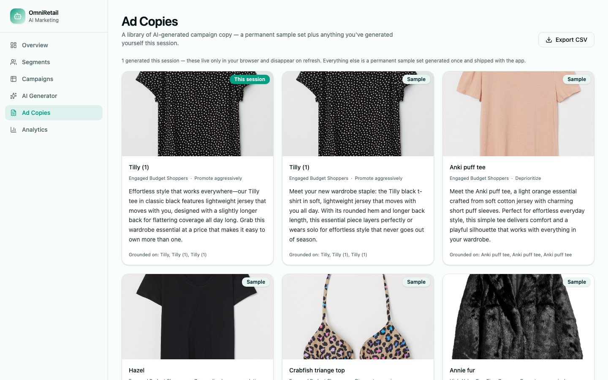
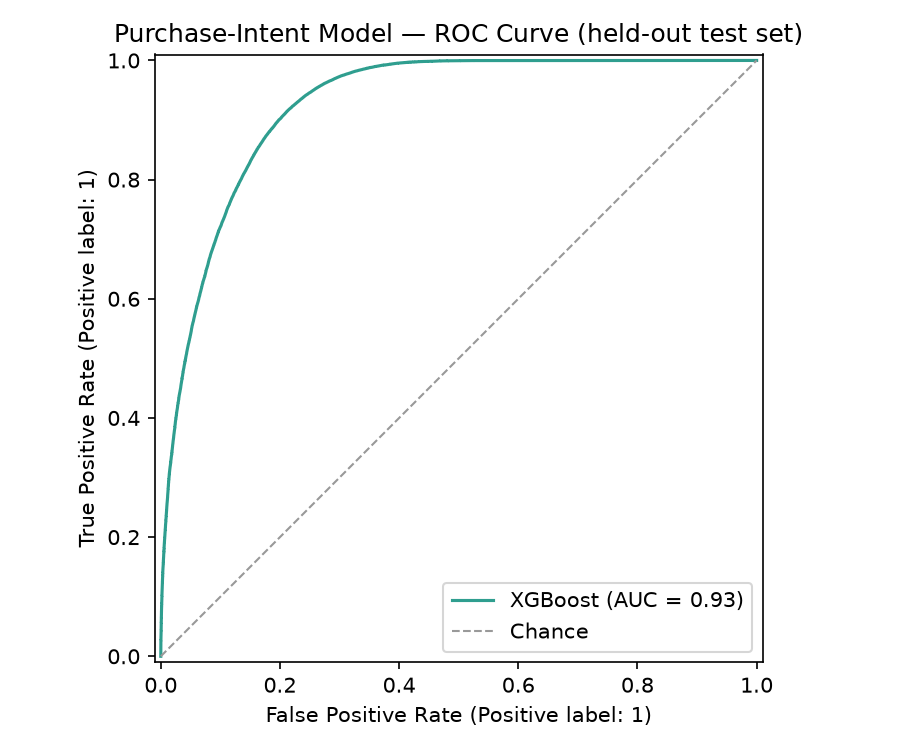
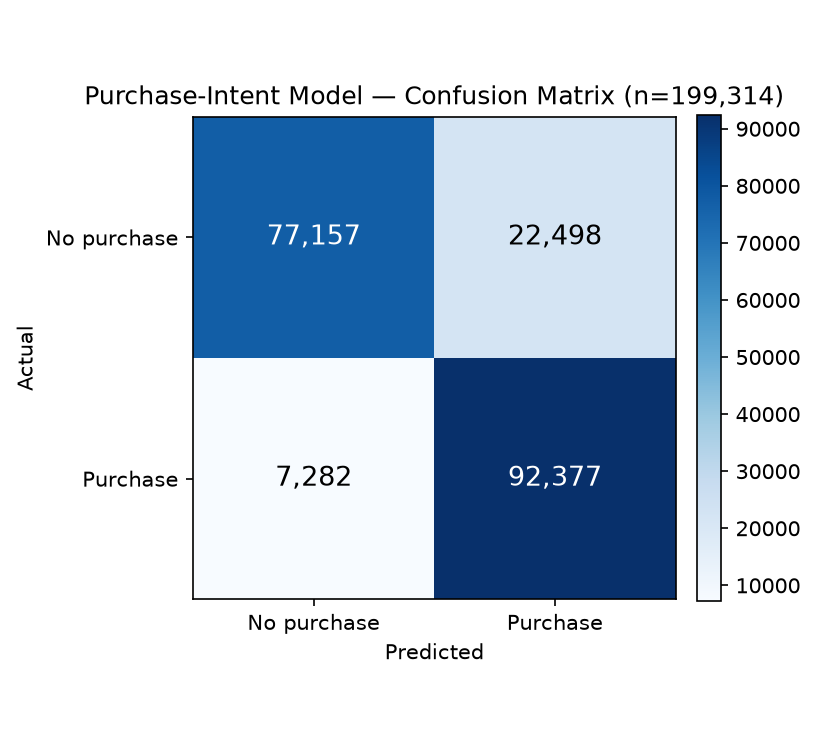
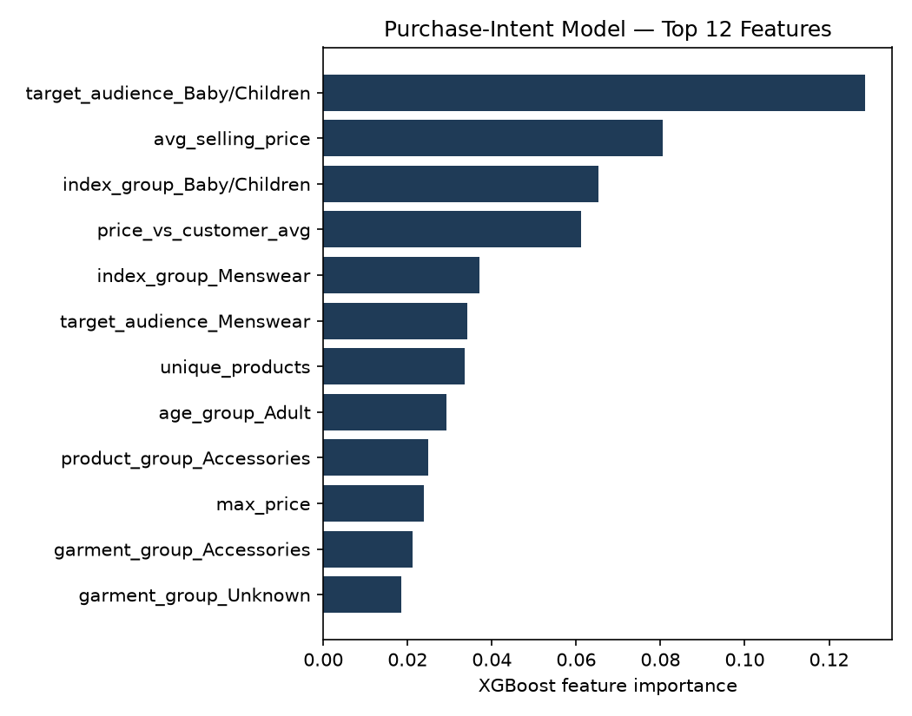

# OmniRetail AI

**Turns raw retail data into AI-ranked campaigns and ready-to-use ad copy.**

<!-- Screenshot below — swap for a demo video/GIF once one exists. -->


🔗 [Try it live](https://tanstack-start-app.letitiachang0807-bb0.workers.dev)

---

## The Problem

Retail marketing teams manage thousands of products across multiple customer segments, but usually lack the tooling to plan campaigns at that scale — planning doesn't scale with catalog size, promotions aren't tied to real purchase likelihood or inventory, and customer segments exist as a concept without an operational targeting workflow.

OmniRetail AI turns raw customer, transaction, and product data into a ranked list of *which product, to which segment, with what strategy* — plus AI-generated ad copy, ready to review and export.

## Key Features

- **Customer segmentation** — KMeans clustering over RFM-style behavioral features into 5 actionable segments, each with a documented targeting strategy
- **Purchase-intent prediction** — an XGBoost classifier estimating purchase probability per customer-product pair (ROC-AUC 0.93)
- **Inventory-aware, strategy-diversified campaign ranking** — combines purchase probability, inventory, and segment fit into one score, spread across every viable promotion strategy instead of just the highest-scoring one
- **RAG-grounded ad-copy generation** — a FAISS index over the product catalog grounds live Claude calls, so generated copy is tied to real product context instead of invented
- **Ad-copy review & export workflow** — a permanent sample library plus a live session history, exportable to CSV
- **Real, reproducible evaluation** — every metric in this README is computed from this repo's own pipeline, not estimated ([full write-up](reports/evaluation.md))

## Product Walkthrough

**Overview** (landing page) — a 4-step workflow guide plus live campaign stats.


**Segments** — pick a segment, see AI-ranked product picks with real images, price tier, and a "why this was picked" explanation.


**Campaigns** — every curated recommendation in one searchable, filterable table.


**AI Generator** — live, RAG-grounded ad copy generated by Claude on demand.


**Ad Copies** — a permanent sample library plus anything generated live this session, exportable to CSV.



**Analytics** — score and inventory distributions across the full scored catalog.


## Tech Stack

| Layer | Tools |
|---|---|
| Data / ML | Python, pandas, NumPy, scikit-learn, XGBoost |
| RAG | FAISS, TF-IDF + TruncatedSVD embeddings, Anthropic Claude (`claude-haiku-4-5`) |
| Data source | [Kaggle H&M Personalized Fashion Recommendations](https://www.kaggle.com/competitions/h-and-m-personalized-fashion-recommendations) |
| Backend | FastAPI, Uvicorn, slowapi (rate limiting) |
| Frontend | React 19, TanStack Start/Router/Query, Tailwind CSS, Radix UI |
| Deployed on | Cloudflare Workers (frontend), Railway (backend) |

## Architecture

<!--
Image-generation prompt for reports/figures/architecture_diagram.png:

Create a clean, modern, professional software architecture diagram (flat
style, light background, muted teal/navy color palette) showing left-to-right
data flow through these stages:

1. Data source: "Kaggle H&M Dataset" (customers, articles, transactions)
2. An "Offline batch pipeline, runs once" cluster:
   - Data cleaning
   - Customer segmentation (KMeans) and Product enrichment (rule-based
     tagging), running in parallel
   - Purchase-intent model (XGBoost), fed by both
   - Campaign ranking (score + diversify across promotion strategies)
   - Campaign generation (templates)
   - Output: CSVs written to disk
3. A branch from Product enrichment: FAISS product index (TF-IDF + SVD
   embeddings)
4. A one-time step from the FAISS index: "Seed ad-copy script (real Claude
   calls, run once)" -> "Permanent ad-copy sample library (CSV)"
5. A "Live, real-time" cluster, visually distinct from the offline cluster
   (e.g. dashed boundary or different shading):
   - FastAPI backend, reading the CSVs (cached in memory) and the FAISS index
   - One live endpoint, /generate-copy: retrieves similar products via
     FAISS, calls Claude Haiku, returns grounded ad copy
6. Client: React dashboard (TanStack Start) on Cloudflare Workers, plus
   browser sessionStorage holding live-generated ad copy for the current
   session only (merged client-side with the permanent sample library,
   never sent back to the backend)
7. Backend deployed on Railway

The single most important thing to convey visually: most of the system is
precomputed offline; only ad-copy generation is live. Clean sans-serif
labels, rounded rectangles, subtle shadows, arrows for data flow, no clutter.
-->

This is a **batch-then-serve architecture, not a real-time system**. The ML pipeline — segmentation, purchase-intent modeling, campaign ranking — runs once and writes its outputs to disk. FastAPI is a thin, cached read layer over those outputs, with exactly one live-inference endpoint: `/generate-copy`, for the RAG ad-copy feature.

Ad copy generated live is never written back to the backend. It stays in the browser's session storage and merges client-side with a small, permanent sample library on the Ad Copies page.

*(Diagram in progress — see the generation prompt in this file's source.)*

## Model Training & Evaluation

Every number below is computed from this repo's own pipeline — see [reports/evaluation.md](reports/evaluation.md) for the full write-up.

**Customer segmentation** — PCA projection and elbow-method justification for k=5.


**Purchase-intent model (XGBoost)** — ROC curve, confusion matrix, and top feature importances on the held-out test set.





## Quick Start

```bash
git clone git@github.com:Letitia-Chang/omni-retail-ai.git && cd omni-retail-ai
python -m venv venv && source venv/bin/activate && pip install -r requirements.txt

python scripts/download_data.py           # requires a Kaggle account + kaggle.json
# then run notebooks/01_data_schema_and_cleaning.ipynb to produce data/processed/hm/

python scripts/run_full_pipeline.py       # segmentation -> purchase intent -> ranking
python scripts/build_product_index.py     # builds the FAISS RAG index

cp .env.example .env                      # set ANTHROPIC_API_KEY for live ad-copy generation
uvicorn backend.main:app --reload         # http://127.0.0.1:8000
```

```bash
cd frontend && cp .env.example .env && npm install && npm run dev   # http://localhost:3000
```

Without `ANTHROPIC_API_KEY`, everything still runs — the Generator falls back to a pre-computed template instead of a live Claude call.

## Limitations

- Bulk product enrichment is rule-based, not LLM-generated — only the interactive Generator path uses live Claude.
- Catalog embeddings are TF-IDF + SVD, not neural — a platform-driven tradeoff (no `torch` wheel supports both Intel macOS and the `numpy>=2` the rest of the stack requires).
- Inventory levels and purchase-intent training pairs are synthetic, not from a real inventory system or clickstream data.
- Price tier is relative (ranked within the curated set), not real currency — H&M's price field in this dataset is a pre-anonymized index.
- Cluster-to-segment-name mapping is a hardcoded index lookup, not derived from cluster properties.
- No automated tests or CI yet.

## License

[MIT](LICENSE)

## Contact

Ting Ya Chang — [LinkedIn](https://www.linkedin.com/in/tingya-chang/) · tingyachang97@gmail.com
