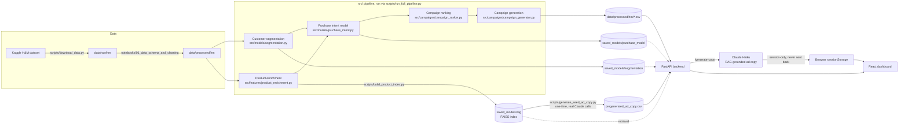

# OmniRetail AI

**An end-to-end retail marketing intelligence pipeline — from raw transaction data to a segmented, ranked, ready-to-ship campaign dashboard.**

Portfolio project built to demonstrate applied data science and ML engineering: customer segmentation, a supervised purchase-intent model, and an inventory-aware campaign ranking system, served through a FastAPI backend and a React dashboard.

> Built for **AI/ML Engineer**, **Data Scientist**, and **Data Analyst** roles.

---

## Problem Statement

Retail marketing teams manage thousands of products across multiple customer segments, but typically lack the tooling to plan campaigns at that scale:

- Campaign planning is manual and doesn't scale with catalog size or customer diversity.
- Promotions are rarely tied to actual purchase likelihood or current inventory, wasting spend on products customers won't buy or that are already out of stock.
- Customer segments exist as a concept ("loyal", "budget-conscious") but aren't operationalized into an actual targeting workflow.

**OmniRetail AI** turns raw customer/transaction/product data into a ranked list of "which product, to which segment, with what strategy" — the concrete output a marketing team would act on.

## Key Features

- **Customer segmentation** — KMeans clustering over RFM-style behavioral features, producing five named segments (e.g. *Loyal High-Value Customers*, *Inactive Budget Shoppers*) with a documented strategy per segment ([reports/segment_strategy.md](reports/segment_strategy.md))
- **Product enrichment** — derives style/occasion tags and marketing attributes per product from catalog metadata
- **Purchase-intent prediction** — an XGBoost classifier trained on simulated customer-product interactions, predicting purchase probability per customer-product pair
- **Inventory-aware, strategy-diversified campaign ranking** — combines purchase probability × inventory signal × segment-fit score into a single campaign score, then allocates each segment's curated picks across every promotion strategy it has candidates for (not just the single highest-scoring one), with a human-readable ranking explanation per recommendation
- **RAG-grounded ad-copy generation** — a FAISS index over the ~105K-product catalog (TF-IDF + SVD embeddings) retrieves similar products at request time to ground a live Claude Haiku call, so generated copy is tied to real catalog context instead of a fixed template
- **Ad copy review & export workflow** — a permanent library of pre-generated sample copy plus anything generated live in your own session, with one-click CSV export — closes the loop from "generate" to "hand off to a marketing team"
- **FastAPI backend** — serves segments, ranked campaigns, summary stats, ad-copy library, and live RAG-grounded copy generation as JSON, with per-endpoint rate limiting and in-memory caching to keep the public demo's cost bounded
- **React dashboard** — a TanStack Start app with 6 views: segment explorer (landing page), campaign list, AI generator, ad copies, analytics, and an overview summary — each with a one-line, dismissible "how this works" explainer for first-time visitors
- **Real, reproducible evaluation** — silhouette score, ROC-AUC, ranking-quality distributions, and a quantitative RAG grounding check, all computed from this repo's own pipeline ([reports/evaluation.md](reports/evaluation.md))

## Tech Stack

| Layer | Tools |
|---|---|
| Data / ML | Python, pandas, NumPy, scikit-learn, XGBoost, joblib |
| RAG | FAISS, scikit-learn (TF-IDF + TruncatedSVD embeddings), Anthropic Claude (`claude-haiku-4-5`) |
| Data source | [Kaggle H&M Personalized Fashion Recommendations](https://www.kaggle.com/competitions/h-and-m-personalized-fashion-recommendations) dataset, via `kagglehub` |
| Backend | FastAPI, Uvicorn, slowapi (rate limiting) |
| Frontend | React 19, TanStack Start/Router/Query, Tailwind CSS, Radix UI |
| Deploy target | Frontend on Cloudflare Workers (Vite plugin + `wrangler` config included); backend on Railway or Render (`railway.json` / `render.yaml` both included) |

## Architecture



## Setup

### 1. Clone and install Python dependencies

```bash
git clone git@github.com:Letitia-Chang/omni-retail-ai.git
cd omni-retail-ai
python -m venv venv && source venv/bin/activate
pip install -r requirements.txt
```

### 2. Get the data

Requires a [Kaggle](https://www.kaggle.com/) account with `kaggle.json` credentials in `~/.kaggle/` (and having accepted the competition rules).

```bash
python scripts/download_data.py
```

Then run [notebooks/01_data_schema_and_cleaning.ipynb](notebooks/01_data_schema_and_cleaning.ipynb) to produce the cleaned `data/processed/hm/` tables the pipeline expects (`customers.csv`, `articles.csv`, `transactions.csv`).

### 3. Run the ML pipeline

```bash
python scripts/run_full_pipeline.py
```

This runs segmentation → product enrichment → purchase-intent modeling → campaign ranking → campaign generation in sequence, writing outputs to `data/processed/hm/` and trained models to `saved_models/`.

### 4. Build the RAG product index

```bash
python scripts/build_product_index.py
```

Embeds the enriched product catalog (TF-IDF + SVD) and builds a FAISS index at `saved_models/rag/` — this grounds the live ad-copy generation endpoint. Takes well under a minute (no GPU or large model download required).

Then copy `.env.example` to `.env` and set `ANTHROPIC_API_KEY` (get one at [console.anthropic.com](https://console.anthropic.com/)) — required for `/generate-copy`. Without it, the dashboard still runs fine and falls back to the pre-computed ad-copy template.

The Ad Copies page's permanent sample library (`data/processed/hm/pregenerated_ad_copy.csv`) is already committed, so no extra step is needed to see it locally. To regenerate it (real Claude API calls): `PYTHONPATH=. python scripts/generate_seed_ad_copy.py`.

### 5. Run the backend

```bash
uvicorn backend.main:app --reload
```

Serves at `http://127.0.0.1:8000` — see `/` for available endpoints.

### 6. Run the frontend

```bash
cd frontend
cp .env.example .env   # points the dashboard at the local API
npm install
npm run dev
```

Dashboard runs at `http://localhost:3000` (TanStack Start dev server).

## Demo

With the backend and frontend both running (`/` redirects straight to Segments — the stronger first-run experience):

1. **Segments** (`/segments`) — explore each customer segment and its top recommended products, with images, price tier, and an expandable "why this was picked" panel
2. **Campaigns** (`/campaigns`) — search/filter the full ranked campaign list
3. **AI Generator** (`/generator`) — walks through a single campaign recommendation with its ranking explanation, and generates live RAG-grounded ad copy via Claude (falls back to a pre-computed template if `ANTHROPIC_API_KEY` isn't set)
4. **Ad Copies** (`/ad-copies`) — a permanent library of sample generated copy plus anything generated live in your own session, with CSV export
5. **Analytics** (`/analytics`) — score distributions and inventory-level breakdowns, computed across the full scored catalog
6. **Overview** (`/overview`) — a 4-step workflow guide plus summary stats (products scored, avg campaign score, active strategies)

## Deploying

The backend and frontend deploy to separate services — Cloudflare Workers doesn't run a Python/pandas/FAISS stack, so the two halves need different hosts.

### Backend: two supported targets

Both configs are kept in the repo — [`render.yaml`](render.yaml) and [`railway.json`](railway.json) — so switching between them doesn't need a rewrite.

**Option A: Railway** (paid, no cold start) — **New Project → Deploy from GitHub repo** in Railway, picks up `railway.json` automatically. Set `ANTHROPIC_API_KEY` in the dashboard. Hobby plan is $5/month (includes $5 usage credit); a service this size typically runs $5–15/month total, but stays running with no sleep-on-idle cold start.

**Option B: Render** (free, cold start) — push to GitHub, then in Render: **New → Blueprint**, picks up `render.yaml` automatically. Set `ANTHROPIC_API_KEY` in the dashboard. Free tier spins down after inactivity, so the first request after a while has a ~30–60s cold start — the tradeoff for $0/month.

Either way, note the deployed URL — the frontend needs it next.

**On product images:** the full H&M image set (~30GB) isn't in the repo (see `.gitignore`) — but the deployed app only ever references the ~99 products in the curated recommendation set, so just those (~25MB) are bundled and tracked directly, and load correctly in production. If you extend the curated set to reference different products, re-bundle their images the same way (see `data/processed/hm/images/`) — the dashboard falls back to a placeholder icon for anything not bundled, so nothing breaks either way.

### Frontend → Cloudflare Workers

Requires Node.js **v22+** (`wrangler` itself won't run on older versions) and a Cloudflare account.

```bash
cd frontend
echo "VITE_API_BASE_URL=https://your-backend-url" > .env   # the URL from the backend deploy step above
npm install
npx wrangler login    # one-time browser OAuth to your Cloudflare account
npm run build
npm run deploy        # wraps `wrangler deploy`
```

`VITE_API_BASE_URL` is inlined into the bundle at build time, so it must point at the deployed backend *before* `npm run build` — rebuild and redeploy if the backend URL ever changes.

## Screenshots

**Segments** (landing page) — pick a segment, browse its AI-ranked product picks with real images, price tier, and a "why this was picked" panel


**Campaigns** — full ranked list with search and filters


**AI Generator** — live, RAG-grounded ad copy generated by Claude on demand, grounded in real similar products


**Ad Copies** — a permanent sample library plus anything generated live this session, with CSV export


**Analytics** — score and inventory distributions across the full scored catalog


**Overview** — a 4-step workflow guide plus live campaign stats and strategy mix


## Model Training & Evaluation Visuals

**Customer segmentation** — PCA projection (showing why silhouette score is moderate — real behavioral segments overlap) and the elbow-method justification for k=5


**Purchase-intent model (XGBoost)** — ROC curve, confusion matrix, and top feature importances on the held-out test set (all regenerated from the actual saved model — see `scripts/plot_purchase_model_evaluation.py`)


## Limitations & Future Improvements

- **Bulk product enrichment (`product_enrichment.py`) is still rule-based** (keyword-matching for style/occasion tags) — only the on-demand ad-copy call in the Generator view (`/generate-copy`) uses a live, RAG-grounded LLM call. Extending the LLM call to bulk enrichment would mean ~105K API calls, which is a batch-processing / cost tradeoff worth its own write-up rather than doing by default.
- **Catalog embeddings are TF-IDF + SVD, not neural embeddings.** This was a deliberate platform-driven choice — no current `torch` wheel supports both Intel macOS and the `numpy>=2` the rest of the stack (`pandas`, `scikit-learn`) requires — but a from-scratch build could swap in a hosted embedding API without touching the FAISS index or the generation call.
- **Inventory levels are synthetic** (randomly assigned per product), not sourced from a real inventory system.
- **Purchase-intent training pairs are simulated**, not from real clickstream/purchase logs beyond the H&M transaction history used for labels — the reported ROC-AUC measures separation from *sampled* negatives, not observed non-purchases.
- **Price tier is relative, not absolute.** H&M's `avg_selling_price` in this dataset is a pre-anonymized 0–1 index, not real currency (42% of the full catalog is literally `0`, meaning "no price history," not "free") — the Budget/Mid-range/Premium badges are ranked against the curated set itself, not a claim about real-world pricing.
- Cluster-to-segment-name mapping is a hardcoded index lookup, not derived from cluster properties — rerunning KMeans on different data could silently relabel segments.
- No automated tests or CI yet.
- No data upload/import UI anywhere in the app, by design — data prep is an offline batch pipeline (`scripts/run_full_pipeline.py`), not something a user of this dashboard does by hand.

**Roadmap:**
1. ~~Repo cleanup~~
2. ~~Add retrieval-augmented generation~~ — FAISS index over the product catalog (`scripts/build_product_index.py`), grounding ad-copy generation in real product context
3. ~~Wire the RAG-grounded generator into the FastAPI backend~~ — `POST /generate-copy`, called live from the Generator view's "Regenerate" button
4. ~~Polish the frontend and deploy~~ — see [Deploying](#deploying) (Cloudflare Workers for the frontend, Railway or Render for the backend)
5. ~~Add a proper evaluation write-up~~ — see [reports/evaluation.md](reports/evaluation.md) (model metrics, ranking quality, RAG grounding quality)
6. ~~Diversify curated recommendations across strategies~~ — campaign ranking now reserves slots per promotion strategy instead of pure top-N-by-score
7. ~~Close the loop on ad-copy generation~~ — Ad Copies review/export page, backed by a permanent sample library plus session-only live history

## License

[MIT](LICENSE)

## Contact

Ting Ya Chang — [LinkedIn](https://www.linkedin.com/in/tingya-chang/)
