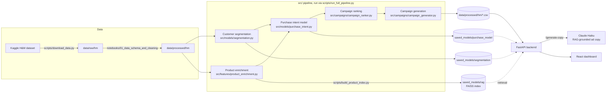

# Architecture

## Walking through it

1. **Raw data** — the Kaggle H&M Personalized Fashion Recommendations dataset (customers, articles, transactions) lands in `data/raw/hm`, then gets cleaned into `data/processed/hm` by the first notebook.
2. **Segmentation and enrichment run in parallel** off the same cleaned data — KMeans clusters customers into five segments; a separate step derives style/occasion tags per product.
3. **Purchase-intent modeling** consumes both — segment membership and product attributes both feed the XGBoost classifier that scores each customer-product pair.
4. **Campaign ranking** combines purchase probability, a (synthetic) inventory signal, and a segment-fit score into one number per recommendation, then keeps the top 20 per segment.
5. **The RAG index** is built independently from the enriched product catalog — it doesn't depend on the modeling pipeline, so it can be rebuilt on its own (`scripts/build_product_index.py`) without retraining anything.
6. **The FastAPI backend** reads the pipeline's CSV outputs directly (no database) and, for the one interactive endpoint (`/generate-copy`), retrieves from the FAISS index and calls Claude Haiku live.
7. **The React dashboard** is the only consumer of the API — everything a user sees is either a precomputed pipeline output or a live generation call, never a client-side computation of the underlying scores.

This is a batch-then-serve architecture, not a real-time system: the ML pipeline runs once (or on a schedule, in a production setting) and writes its outputs to disk; the API layer is a thin, fast read path over those outputs, with exactly one live-inference endpoint bolted on for the RAG feature.
